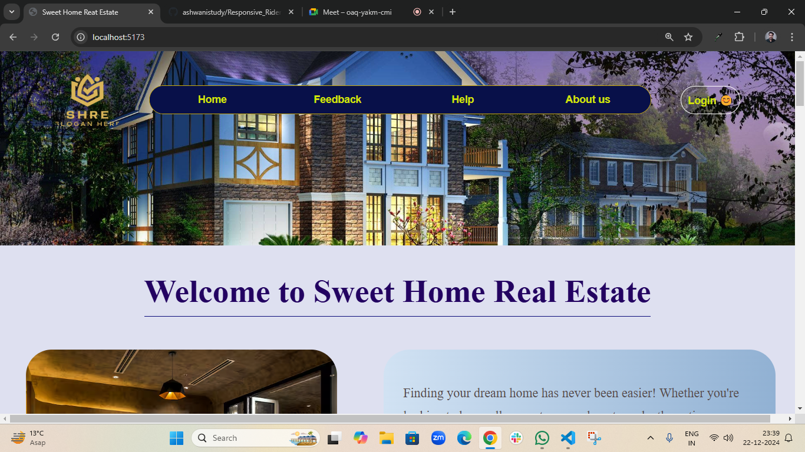
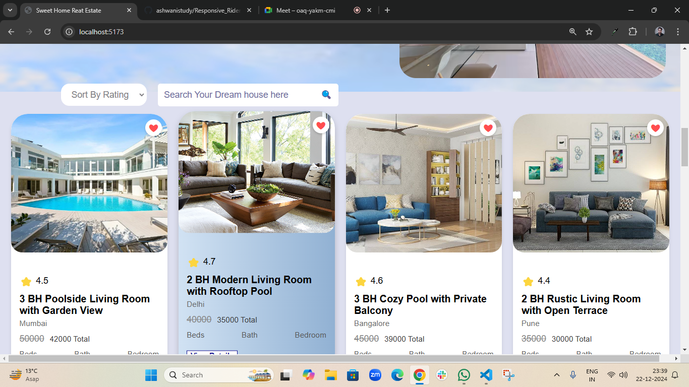
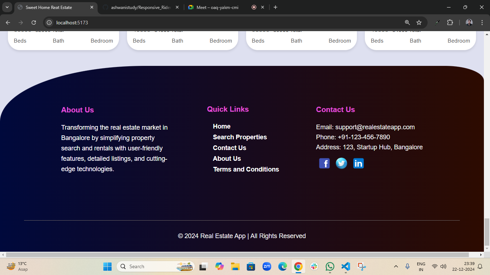
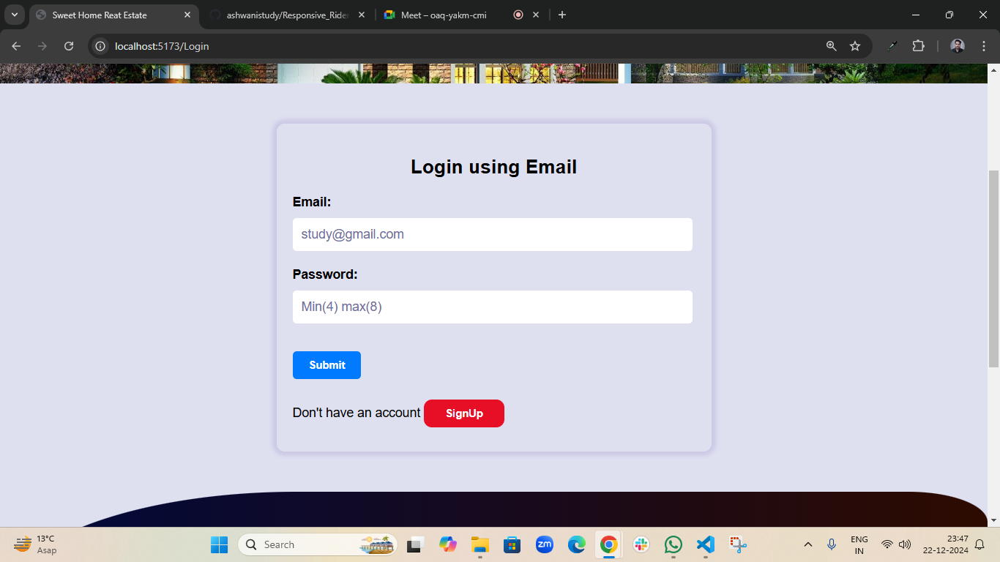
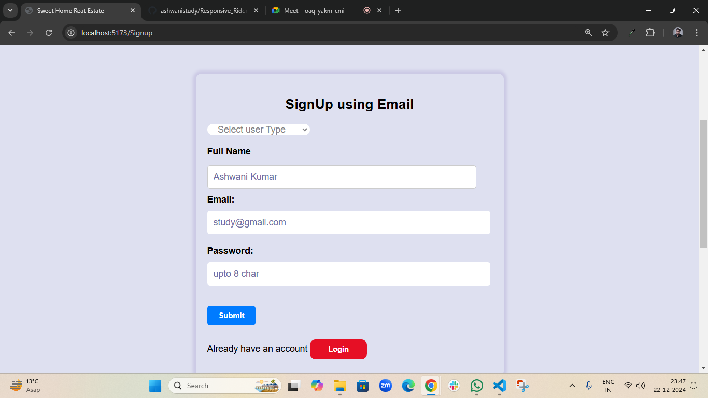
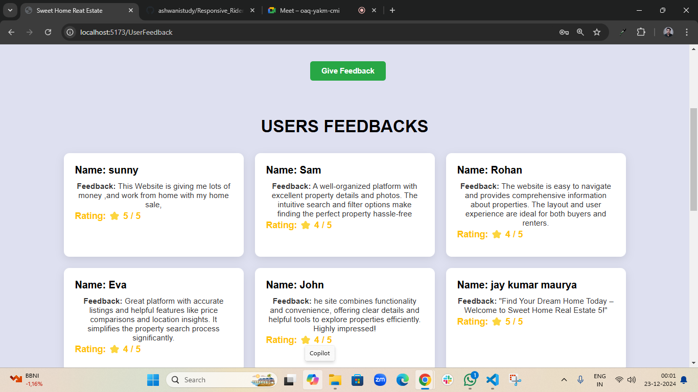
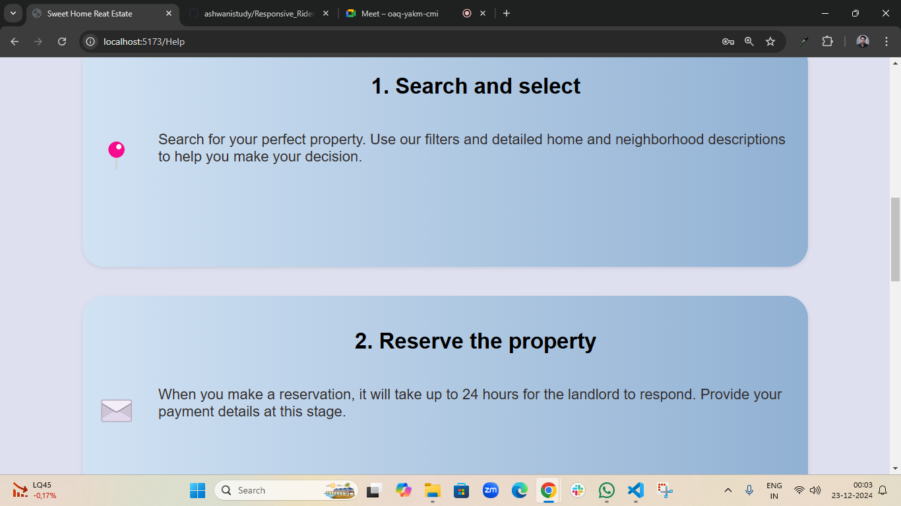
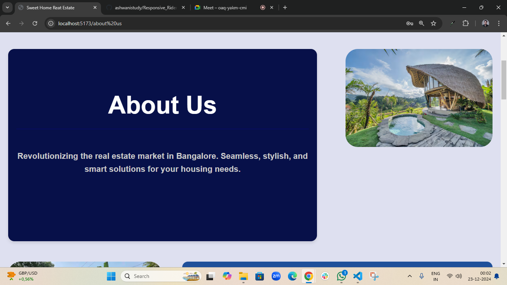

<h2>Project Name ----> Sweet Home Real Estate</h2>
<h2>Tech Stack ----> Node, React, Redux, Firebase, Express </h2>
<h2>Node version ----> 22.12.0</h2>
<h2>React version ----> 18.3.1</h2>
<h2>Deployed link -----> https://easy-buy-or-rent.netlify.app/ </h2>
 
 

<h2>Dependencies</h2>
<h3>axios ---> 1.7.9<h3>
<h3>react-redux ---> 9.2.0</h3>
<h3>redux ---> 5.0.1</h3>
<h3>react-router-dom ---> 7.0.2</h3>

 
 

<h2>NavBar Home</h2>
<h4>Use the NavBar to navigate through all the application</h4>

 
 
<h2>Main Section of Home</h2>
<h4>All the available Properties will be shown here</h4>

 
 
<h2>Footer Home</h2>
<h4>Use the Footer to get more information of this application</h4>

 
 

<h2>Login Page</h2>
<h4>first Login to Add business to this webpage</h4>

 
 

<h2>SignUp Page</h2>
<h4>SignUp to Add your business</h4>

 
 

<h2>Feedback Page</h2>
<h4>Give us your valuable feedback from this page</h4>

 
 
<h2>Help Page</h2>
<h4>Let Us know if you are facing any issue using this page</h4>

 
 
<h2>About Us Page</h2>
<h4>Know more about our Mission & Goals using this page</h4>

